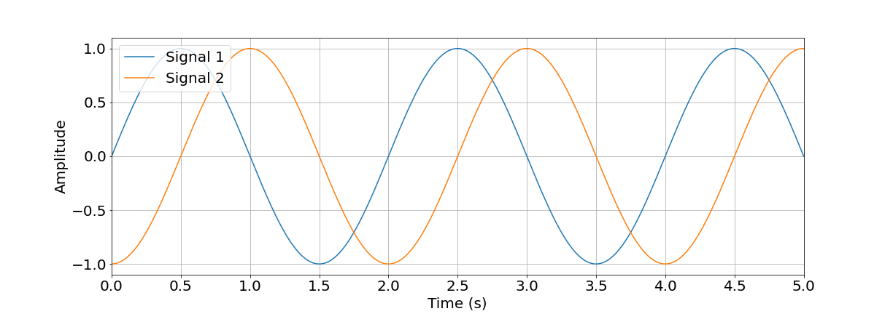
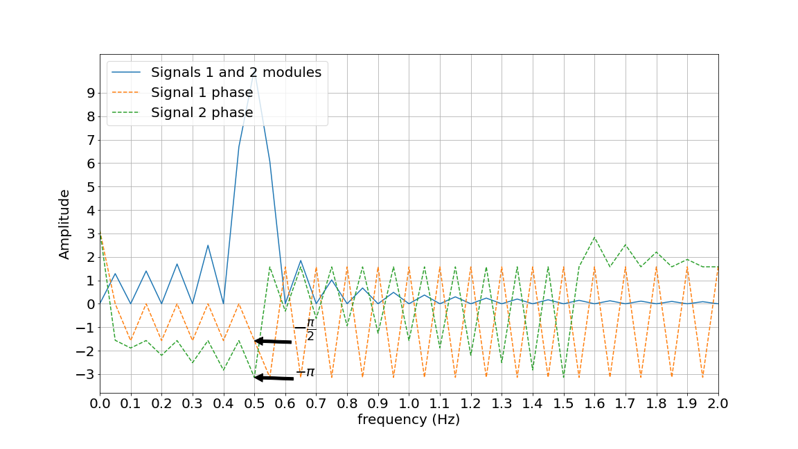
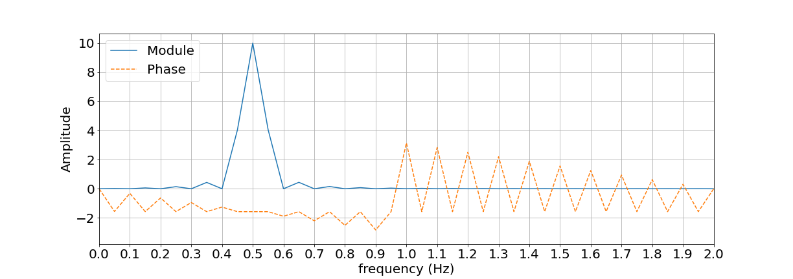
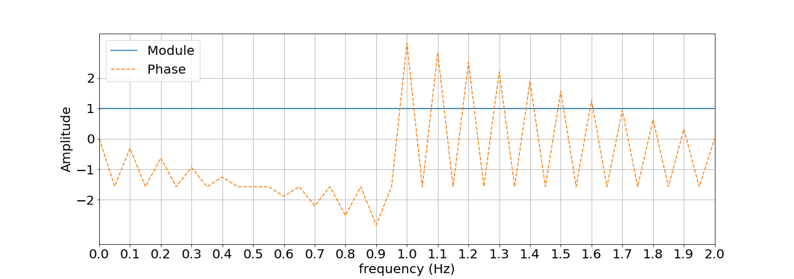
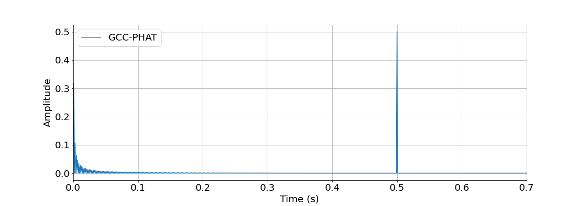

<h1 align="center">Generalized Cross-Correlation with Phase Transform</h1>

Consider two identical sine signals, except for the phase, with a period of 2 seconds, as you can see in the time domain representation in the figure below. The delay of the second signal to the first is 0.5 seconds, which is equivalent to a pi/2 rad between them.

    

The signal plotted in blue represents the original signal, used as a reference, and the signal plotted in orange represents the delayed signal. Passing the two signals to the frequency domain, through the DFT (Discrete Fourier transform), we get the following result:

    

In this figure, the modules of signals 1 and 2 are represented in blue, it's the same for both cases, because the signals are equal, the only difference is the phase between them. The amplitude of the result of this DFT has the maximum value at the 0.5 Hz point, because this is the frequency of the signals. The phases are represented by the dotted lines in green and orange, and at the point where the amplitude of the module is maximum, it's possible to observe the difference of pi/2 rad between them.

Multiplying signal 2 by the complex conjugated of the signal 1 in the frequency domain, the following result has been obtained:

    

Where the blue line represents the magnitude of this signal and the orange dotted line represents the phase.

Applying the weighting function, which in this case is the phase transformation, the signal projected in blue in the next figure has been obtained. At this point, there was a leveling of the frequency amplitude, leaving the signal depends only on the phase.

    

Calculating the inverse Fourier transform to obtain the signal in the time domain, the result of the GCC-PHAT has been obtained, with a maximum value at 0.5, which is exactly the time difference that existed between the original signals.

    

